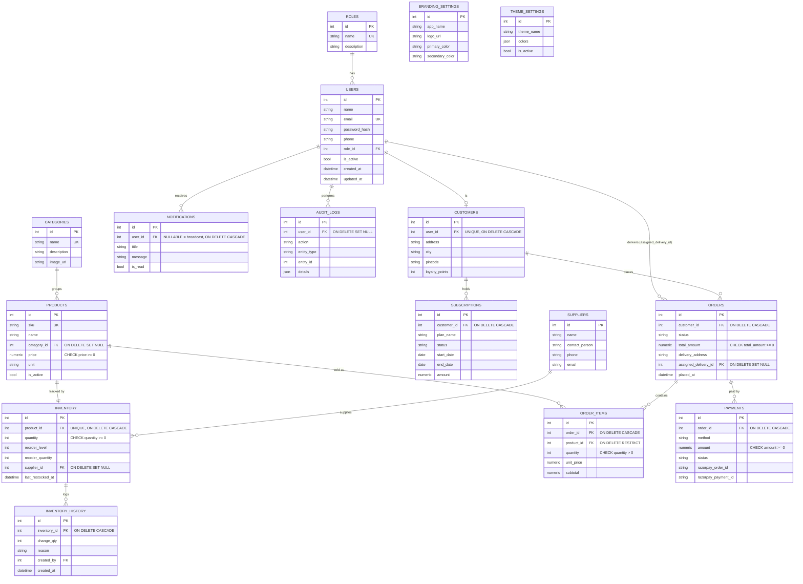

# Database Schema

PostgreSQL in production (SQLite fallback for local dev — see
`backend/config/config.py`). Schema is defined in `backend/models/*.py` and
applied via Alembic (`backend/migrations/versions/`), not by hand-written SQL.

## Entity-relationship diagram



## Notes on cascade rules

- Deleting a `User` cascades to their `Customer` profile and `Notifications`
  (a customer account and its own profile/notifications are one lifecycle).
- Deleting a `Product` cascades to its `Inventory` row (soft-delete via
  `is_active=false` is used instead of hard delete in the API — see
  `DELETE /api/products/<id>`).
- Deleting an `Order` cascades to `OrderItems` and `Payments`.
- `OrderItems.product_id` uses `ON DELETE RESTRICT` — a product referenced by
  historical order line items cannot be hard-deleted, which is why the
  product delete endpoint deactivates rather than removes rows.
- `Inventory.supplier_id`, `Order.assigned_delivery_id`, and
  `AuditLogs.user_id` use `ON DELETE SET NULL` so removing a supplier or
  staff account doesn't destroy historical records.

## Indexes

Unique/lookup indexes on `users.email`, `products.sku`, `products.name`,
`categories.name`, `roles.name`; query-pattern indexes on `orders.status`,
`orders.placed_at`, `payments.status`, `payments.razorpay_order_id`,
`payments.razorpay_payment_id`, `inventory_history.created_at`,
`notifications.created_at`, `audit_logs.created_at`, and a composite index on
`inventory(quantity, reorder_level)` for the low-stock query.

## Migrations

```bash
cd backend
flask db upgrade                 # apply migrations/versions/*.py
flask db migrate -m "message"    # generate a new migration after model changes
```

The initial migration (`migrations/versions/454bef96b498_*.py`) was generated
with `flask db migrate` against the real models — it is not hand-written —
and has been applied and verified against a live SQLite database as part of
this build (see `docs/DEPLOYMENT_GUIDE.md` for the PostgreSQL equivalent).
